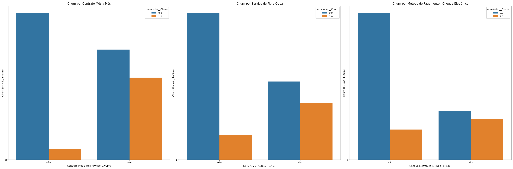

# Previsão de Churn de Clientes - Análise de Dados e Modelagem Preditiva parte 2

##  Objetivo

Este projeto tem como objetivo principal **prever a evasão de clientes (churn)** do desafio Challenge Telecom X: análise de evasão de clientes - Parte 2 com base em variáveis contratuais, de comportamento e serviço. A ideia é identificar padrões e fatores que influenciam a saída dos clientes, oferecendo assim **insights estratégicos para retenção** e **modelos preditivos eficazes**.

## Preparação dos Dados

### Etapas de tratamento dos dados

1. **Normalização e Padronização**: transformei as variáveis categóricas de sim e não em números binários.
2. **Codificação de variáveis categóricas**: utilizei `OneHotEncoder` para transformar as variáveis não-numéricas.
3. **Balanceamento das classes**: como a evasão é uma classe minoritária, apliquei **balanceamento apenas no conjunto de treino**, preservando a realidade no teste.
4. **Separação dos dados**:
   - **Treino e teste** com proporção 70/30.
   - O conjunto de teste **não foi balanceado**, para manter uma avaliação realista.

---

## Análise Exploratória (EDA) e Insights

### Fatores com **correlação positiva** com a evasão:
- **Contrato mensal**: mais flexível, menos fidelização.
- **Fibra óptica**: pode estar associado a problemas de qualidade.
- **Pagamento eletrônico**: leve tendência à evasão.

### Fatores com **correlação negativa**:
- **Presença de parceiros ou dependentes**.
- **Ausência de serviço de internet**.
- **Contratos longos (2 anos)**.
- **Tempo na empresa (tenure)**.

### Métricas visuais geradas:
- Gráficos de barra comparando churn com as variáveis mais relevantes na correlação.
#### Correlação positiva



---

## Modelagem e Avaliação

### Modelos aplicados:

### Justificativas para decisões:

- **Random Forest superou KNN** em todos os cenários.
- O uso de apenas as features mais importantes **prejudicou a acurácia geral**, pois perdeu-se contexto.
- Métricas como **f1-score e recall foram priorizadas**, pois o foco é detectar corretamente os clientes que **vão sair** (classe minoritária).

---

## Estratégias de Retenção Propostas

1. **Reformulação dos contratos mensais**: incentivar planos de longo prazo.
2. **Melhoria do serviço de internet (fibra óptica)**: foco em qualidade e suporte.
3. **Fidelização de clientes antigos**: programas de benefício por tempo de casa.
4. **Ofertas personalizadas para famílias**: atrair perfis com maior permanência.
5. **Onboarding estratégico nos primeiros meses**: atuar no momento mais crítico de churn.

---

### Requisitos

Disponíveis em requirements.txt.

```bash
pip install -r ML/requirements.txt
# ou
pip3 install -r ML/requirements.txt

### Autor
Projeto desenvolvido por Marcus Miller como parte de um desafio de análise de dados no setor de telecomunicações.

### Licença
Projeto para fins educacionais.
